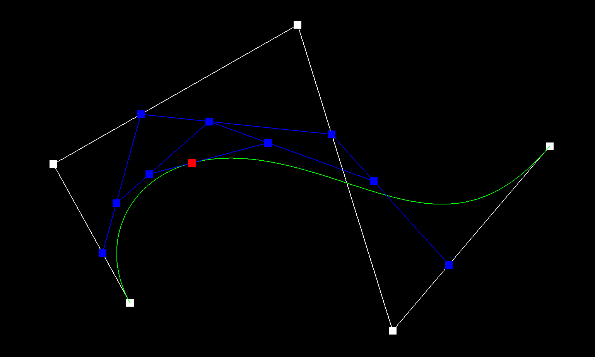
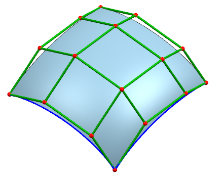

# Lab 8: Bezier Curves and Surfaces

In this lab we take a closer look at Bezier curves and surfaces. In computer graphics, Bezier curves and surfaces areparametric curves and surfaces that are frequently used to model smooth and indefinitely scalable curves andsurfaces. 

A Bezier curve of degree n is defined by (n + 1) control points. Similarly, a Bezier surface of degree (n, m) is defined by(n + 1)(m + 1) control points. A Bezier curve is a parametric curve defined by a single parameter, t, which ranges between 0 and 1. Similarly, a Beziersurface is a parametric surface defined by two parameters, u and v. Using de Casteljau's algorithm, we can evaluatethese parametric curves and surfaces for any given set of parameters.

## Section 1:  Bezier curves with 1D de Casteljau subdivision

In this section we will work with generic Bezier curves, though we will look at cubic Bezier curves as our motivating example and extend the concept from there to support any order Bezier curve. To get started, take a look at bezierCurve.h and examine the protected variables defined within the class. Let's briefly go over the purpose of ones you will primarily be concerned with:

- std::vector< std::vector<Vector2D> > `evaluatedLevels`: A 2D vector containing the evaluated points at each level of subdivision when applying de Casteljau's algorithm. Initially, it contains a single vector representing the starting level containing just the original control points. You should add additional levels with their respective "intermediate control points" every time `evaluateStep` is called. For example, a cubic Bezier curve should have 4 total levels, where the first level contains the original control points and the final level contains just a single evaluated point that represents *B(t)* (the Bezier curve evaluated at *t*).

- float `t`: A parameter varying between 0.0 and 1.0 at which to evaluate the Bezier curve

### Part 1: Base Case

Go to `evaluateStep()` in `student_code.cpp`.

Return immediately if `evaluateStep()` has been called enough number of times to completely solve for the point at **B(t)**.

Hint: Think in terms of the number of points at the top (most recent) level of `evaluatedLevels`.

### Part 2: Evaluation Loop

Go back to `evaluateStep()` in `student_code.cpp`.

`push_back` an empty level into `evaluatedLevels()`. Let's call it level **m**

Loop over all the points in level **m-1** (the second-to-last level) of `evaluatedLevels()`. Grab 2 control points in each iteration to compute a single control point in the next level (**m**). Now push this control point into **m**.

For details on how to find control points refer back to the lecture slides.

To test your code, run the following command:

    make; ./meshedit ../bzc/curve1.bzc

Using the GUI: 

There are two keyboard commands:

  **E**: Perform one call to `evaluateStep`; will cycle through the levels once fully evaluated
  
  **C**: Toggles whether or not the entirely evaluated Bezier curve is drawn to the screen 
  
Step through the evaluation of *B(t)* by repeatedly pressing **E** to verify your implementation is correct. Toggle the Bezier curve using **C** to check that the curve correctly follows from its control points. Besides these keyboard commands, there are some neat controls with your mouse:

**Click and drag** the control points to move them and see how your Bezier curve (and all intermediate control points)changes accordingly

**Scroll** to move the evaluated point along the Bezier curve and see how the intermediate control points move alongwith it; this is essentially varying $t$ between 0.0 and 1.0

## Section 2: Bezier surfaces with separable 1D de Casteljau subdivision

We will work only with cubic Bezier surfaces. To get started, take a look at `bezierPatch.h` and examine the class definition. In this part, you will be working with:

- std::vector< std::vector<Vector3D> > `controlPoints`: A 2D vector representing a 4x4 grid of control pointsthat define the cubic Bezier surface. This variable is initialized with all 16 control points.
    
- Vector3D `evaluate(double u, double v)` const: You will fill this function in, which evaluates the Bezier curve atparameters (u, v). In mathematical terms, it computes B(u, v).

- Vector3D `evaluate1D(std::vector<Vector3D> points, double t)` const: An optional helper function that youmight find useful to implement to help you with your implementation of evaluate. Given an array of 4 points thatlie on a single curve, evaluates the curve at parameter t using 1D de Casteljau subdivision.

### Part 1: Evaluate 1D

Go to `evaluate1D` in `student_code.cpp`.

Given an array of 4 points that lie on a single curve, evaluate the Bezier curve at parameter `t` using 1D de Casteljau subdivision.

Populate `levels` by iteratively adding all the control point levels to it. In each iteration you will need to:

- Collect the control points from the top-most level **m-1**.

- Create a new empty level **m**.

- Use the control points from **m-1** to compute and push the control points in **m**.

Once you have completely populated levels, collect and return the final point *B(t)*. Make sure what you're returning is a **Vector3D** and not a *vector<Vector3D>*.
    
### Part 2 - Homework:

Go to `evaluate` in `student_code.cpp`

Implement this function, which completely evaluates the Bezier surface at parameters `u` and `v` through de Casteljau subdivision.

Use the following algorithm to repeatedly apply separable 1D de Casteljau's algorithm in both dimensions to evaluatethe Bezier surface:

- For each row i:  
    
     Let q(i, u) := apply de Casteljau's algorithm with parameter u to the i-th row of control points

- Let p(u, v) := apply de Casteljau's algorithm with parameter v to all q(i, u) 
  
  Return p(u, v)
    

You may find the `evaluate1D` function that you just created to be extremely useful.

To test your implementation, run the following command:

    make; ./meshedit ../bez/teapot.bez
    
    
  

Note that the homework and lab must be submitted separately.

Take a look at [this interactive demo](http://vladamakaric.github.io/InteractiveBezierSurface/) of a Bezier Surface.
