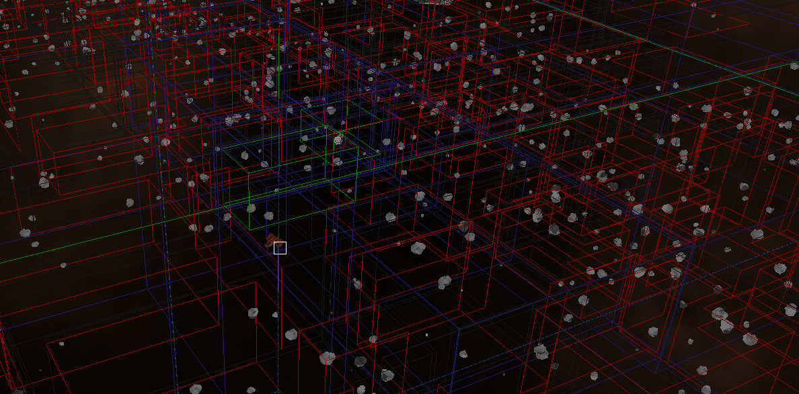
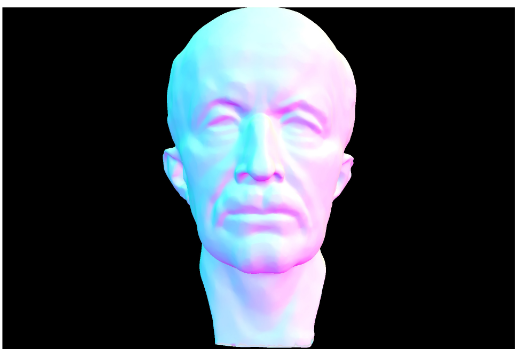
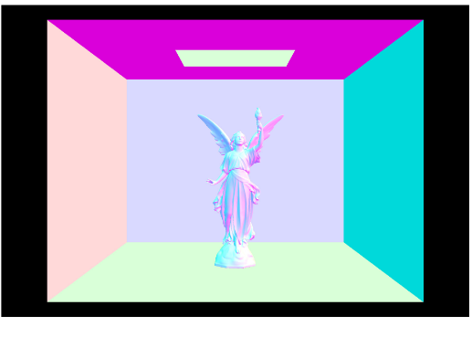

# Homework 4: Bounding Volume Hierarchy (Intersection)

## Logistics

### Deadline
* The deadline for the entire assigment is 11:55pm Monday, 19th Oct 2020.
* Late submission policies apply as stated on LMS.

### Building the assignment

In your assignment directory, execute this command:

```
mkdir build && cd build && cmake .. && make
```


## TASK: Intersecting BVHAccel

Using the lab parts, implement the two `BVHAccel::intersect()` routines inside `bvh.cpp`. 

The starter code assumes that `root` is a leaf node and tests the ray against every single primitive in the tree. Your improved method should implement [this](https://cs184.eecs.berkeley.edu/sp19/lecture/9-74/raytracing) recursive traversal algorithm. 

Note: 

- You can safely return false if a ray intersects with a BBox but its `t` interval has an empty intersection with the ray's interval from `min_t` to `max_t`. 

- In the version with no `isect` parameter, you can safely return true after a single hit. However, the other version must return the closest hit along the ray, so it needs to checkevery BBox touched by the ray.

- If all primitives update `r.max_t` correctly in their own intersection routines, you don't need to worry about making sure the ray stores the closer hit in `BVHAccel::intersect()` since it will be taken care of automatically. 

Once this part is complete, your intersection routines should be fast enough to render any of ourscene files in a matter of seconds (with normal shading only), even ones like `dae/meshedit/maxplanck.dae` with tens of thousands of triangles:




Or `dae/sky/CBlucy.dae`, with hundreds of thousands of triangles:


