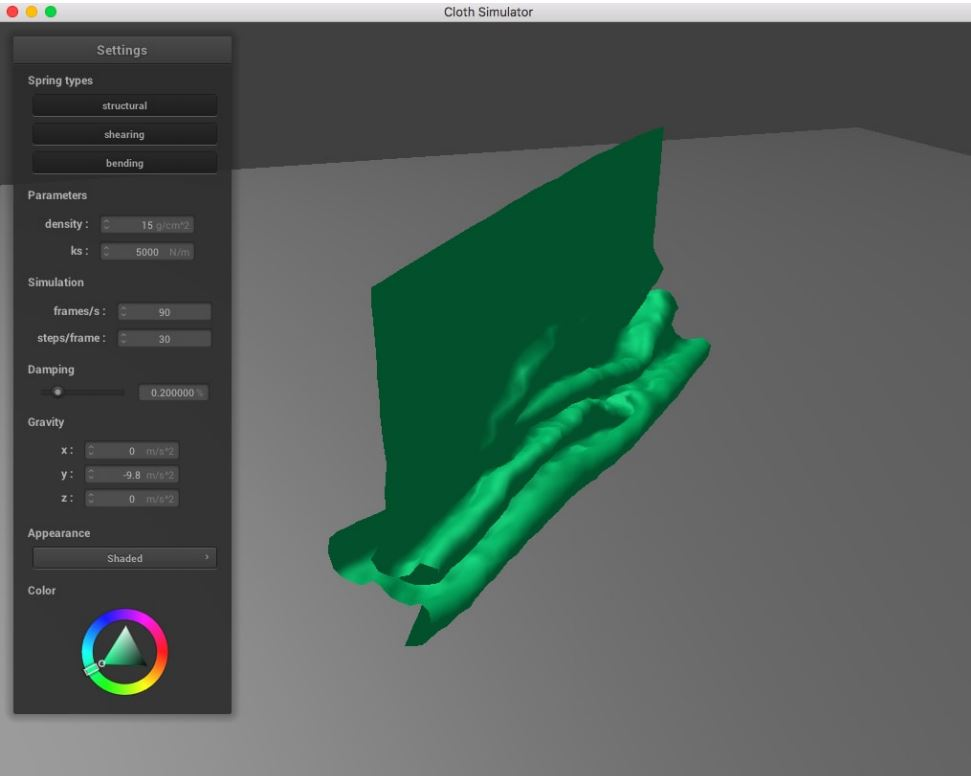

# Homework10: Cloth Collisions

In this homework we will add support for cloth collision with various objects in the scene to make things more interesting.

Take a look at the *collision* directory, which contains struct definitions for a sphere and a plane. For both `sphere.cpp` and `plane.cpp`, you will implement the
`collide` method. At a high level, the collide method will determine whether or not a given point mass is inside the primitive. If it is, we adjust the point
mass's position so that it stays just outside the primitive's surface, accounting for friction as we do so.

## Task1: Handling Collisions with Spheres

Before writing any code, look at the struct definition for a sphere in `collision/sphere.h`.

Implement Sphere::collide, which takes in a point mass and adjusts its position if it intersects with or is inside the sphere. If the point mass intersects with or is inside the sphere, then "bump" it up to the surface of the sphere:

Step1) Compute where the point mass should have intersected the sphere, if it had travelled in a straight line from its position towards the sphere's origin. Call this the tangent point.

Step2) Compute the correction vector needed to be applied to the point mass's `last_position` in order to reach the tangent point.

Step3) Finally, let the point mass's new position be its `last_position` adjusted by the above correction vector, scaled down by friction (i.e. scaled by (1 - f)).

To test your implementation, run the following command:

    ./clothsim -f ../scene/sphere.json

You should see your cloth fall on a sphere and drape itself over it before coming to rest.

## Task2: Handling collisions with planes

Before writing any code, look at the struct definition for a plane in `collision/plane.h`.

Implement Plane::collide, which takes in a point mass and adjusts its position if it is "inside" the plane, which we define to be when the point moves from one side of the plane to the other in the last time step. If the point mass crosses over, then we "bump" it back up to the side of the surface it originated from:

Step1) Compute where the point mass should have intersected the plane, if it had travelled in a straight line from its position towards the plane. Call this the tangent point.

Step2) Compute the correction vector needed to be applied to the point mass's `last_position` in order to reach a point slightly above the tangent point, on the same side of the plane that the point mass was before crossing over. We have provided a small constant SURFACE_OFFSET for this small displacement.

Step3) Finally, let the point mass's new position be its `last_position` adjusted by the above correction vector, scaled down by friction (i.e. scaled by (1 - f)).

To test your implementation, run the following command:

    ./clothsim -f ../scene/plane.json

You should see your cloth fall slowly onto the plane and stop at its surface.

## Task3: BONUS [ungraded]: Self Collisions

One thing that our implementation currently fails to handle is cloth self-collision. As a result, if we have a scene in which the cloth falls on itself or otherwise
folds on itself, the cloth will clip through and behave strangely. You may have seen this type of issue before in video games.
Try it for yourself without any self-collision code:

./clothsim -f ../scene/selfCollision.json

The cloth ignores itself and falls onto the plane!
To solve this, we will implement cloth self-collision. The naive method of doing this is to loop through all pairs of point masses, compute the distance between
them, and then apply a modifying force to the two point masses if they are within some threshold distance apart. However, this O(n^2) solution is too inefficient
for real-time simulations, especially as the cloth gets more complex and larger.
Instead, we will implement spatial hashing. At each time step, we build a hash table that maps a float to a vector<PointMass \*>, which is stored as map in the
Cloth struct. The float uniquely represents a 3D box volume in the scene and the vector<PointMass \*> contains all of the point masses that are in that 3D
box volume. Once the map is built, we simply have to loop through the point masses, look up (using the hash table) the point masses that it shares the same 3D
volume with, and then apply a repulsive collision force if any pair of point masses are too close to each other.
Complete the `Cloth::hash_position`, `Cloth::build_spatial_map` (done for you), and `Cloth::self_collide methods`

#### Cloth::hash_position
Cloth::hash_position takes a point mass's position and uniquely map it to a float that represents a specific 3D box volume. One way to do this is effectively
partition the 3D space into 3D boxes with dimensions w * h * t where w = 3 * width / num_width_points, h = 3 * height / num_height_points, and t
= max(w, h). (Side note: The constant 3 here is somewhat empirically chosen to improve the accuracy of the spatial hashing algorithm.) Then, take the position
and truncate its coordinates to the closest 3D box (hint: think modulo). Using these new coordinates, compute a unique number that corresponds to those 3D
coordinates and return it. This will be used as the unique key in our hash table.

#### Cloth::build_spatial_map
Cloth::build_spatial_map should loop over all point masses and use the Cloth::hash_position method to populate the map as described above.

#### Cloth::self_collide
Cloth::self_collide takes in a point mass and looks up potential candidates for collision using the hash table. For each pair between the point mass and a
candidate point mass, determine whether they are within 2 * thickness distance apart. If so, compute a correction vector that can be applied to the point mass
(not the candidate one) such that the pair would be 2 * thickness distance apart. The final correction vector to the point mass's position is the average of all of
these pairwise correction vectors, scaled down by simulation_steps (this helps improve accuracy by reducing the potential number of sudden position
corrections). **Make sure to not collide a point mass with itself!**

To test your implementation, run the following command:

    ./clothsim -f ../scene/selfCollision.json

You should see your cloth folding on itself rather than clipping through itself as it falls to the ground. Yay!
However, you may notice that your cloth will continue to flatten itself out over time rather than coming to a more natural, realistic stop. (In real life, damping
factors like friction, heat loss, etc. all contribute to net energy loss in the cloth system.) This is because even in a "resting state" on the ground plane, the cloth's
point masses will continue to repel each other due to lack of damping spring forces in our model (which is more difficult to do physically accurately using
Verlet integration). Don't worry if your cloth is exhibiting this behavior! What's important is that your cloth does not clip through itself and exhibits folding on
itself.

## Task 4: BONUS [ungraded]: Advanced Cloth Simultation

For this part, try adding some additional technical features to further improve your cloth simulation! Feel free to browse recently published research
papers, or check out some of the following suggested ideas:

• Add wind (which is a spatially varying force)

• More robust self-collisions than spatial hashing (e.g. use a axis-aligned bounding box hierarchy to figure out where parts of the cloth intersect)

• Better rendering of the cloth (e.g. different shaders than Phong shading)

• Add the ability to move objects using the GUI around in the scene and have them collide with objects (could move the cloth, or move the sphere or
plane, etc.)

• Add other 3D primitives and show that your cloth properly collides with them

You may need to modify other parts of the simulation infrastructure as well as add your own source files. Exercise your creativity and feel free to run all over the skeleton!
