# Homework7: OpenGL-Catapult

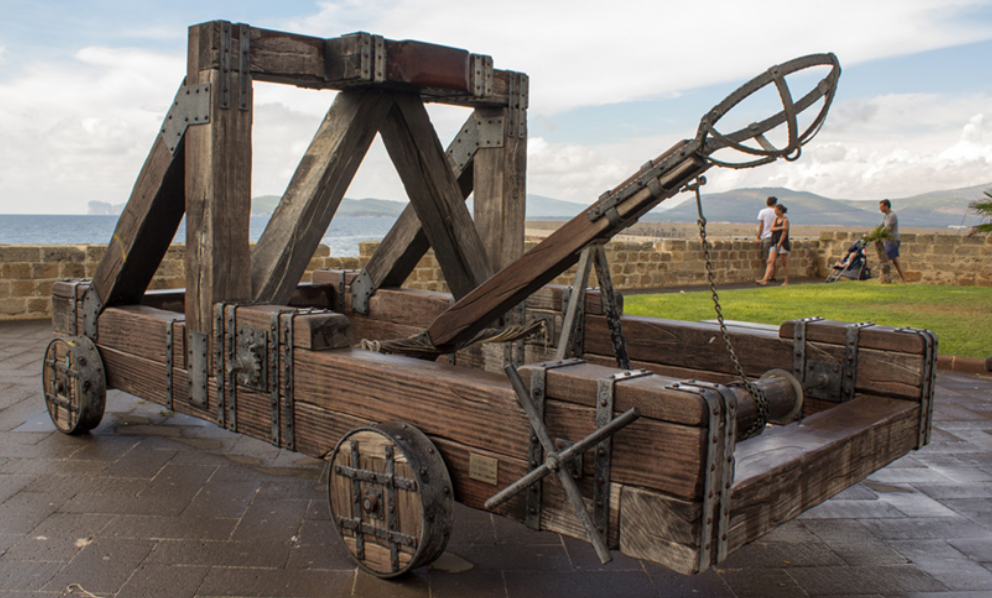

In this homework you will be using OpenGL for creating a simple 3D model of a catapult.

Some functionality has already been implemented for you. This includes:
  
- The camera system controlled by Q,W,A,S,Z and X keys.

- The catapult's arm (red) and arm attachment point (blue).

- The forward and backward movement of the catapult using the correspoding arrow keys.

- The rotation of the arm and arm-attachment point using the left and right arrow keys.

- The function that draws a single wheel: `drawWheel()`.

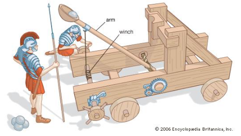

The skeleton code for catapult has been implemented in the `drawCatapult()` function. The variables at the top of the file `rotBuck`, `rotarm` and `rotAttach` store the angles of rotation for the **Bucket**, **Arm** and **Arm-attachment** respectively. Their values are updated whenever the player presses **F3/F4**, **F1/F2**, and **left/right** keys respectively. If the rotations don't work for you, try holding the **fn** key while you press F1,F2,F3 or F4. 

The fire or launch is maneuvered whenever the F5 key is pressed.

    g++ MobileCatapult.c -lglut -lGLU -lGL; ./a.out

Upon running the above command, you should see the following output:

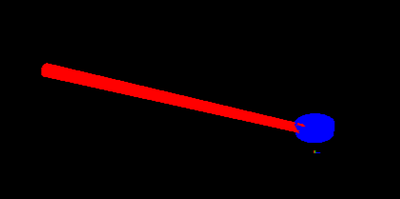 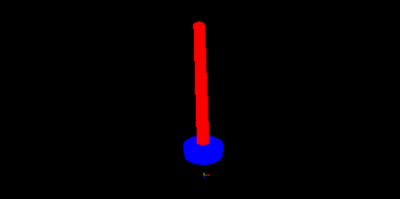

## Part1: Base

Go to `drawBase()` function in `MobileCatapult.c`

Draw the base of the catapult. One possible way of achieving this is by drawing 6 different quadrilaterals placed in arrangement of a cuboid. Consider `GL_QUADS` (covered in lab) for this purpose.

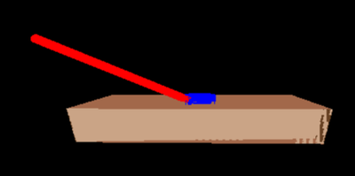 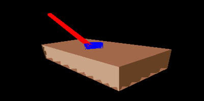
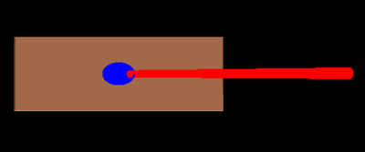 

## Part2: Wheels

Go to `wheelSystem()` function in `MobileCatapult.c`

Use the `drawWheel()` function to draw and place at least 4 wheels around the catapult. You are not required to add any rotation functionality to the wheels.

One possible scheme for placing a single wheel could be:

    glPushMatrix(); // Wheel1
    
      glTranslatef( ... );  // Position the wheel
    
      glRotatef( ... );     // Align the wheel
    
      drawWheel( ... );     // Draw the wheel
    
    glPopMatrix();

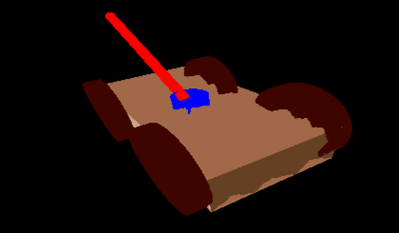 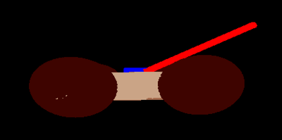
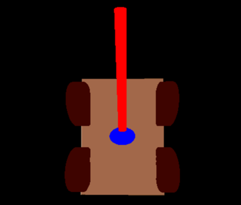 

## Part3: Bucket

Go to `bucketSystem()` function in `MobileCatapult.c`

Draw and place a bucket at the tip of the catapult's arm. The only requirement for the bucket is to have some hollow space in the middle of the bucket.

Feel free to fill and use the `drawBucket()` as a helper function.

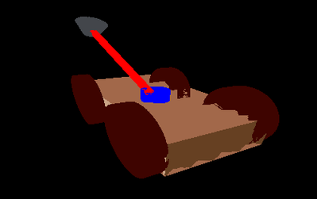 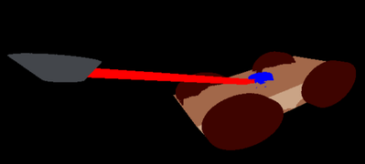

## Bonus [ungraded]: Skybox

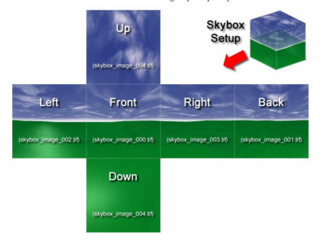

“A skybox is  a  method  of  creating  backgrounds  to  make  acomputer  and  video  games level look  bigger  than  it  really is. When a skybox is used, the level is enclosed in a cuboid. The sky, distant mountains, distant buildings, and  other  unreachable  objects  are  projected  onto  the  cube's  faces  (using  a  technique  calledcube  mapping),  thus  creating the illusion of distant three-dimensional surroundings.” [Wikipedia].

Search the internet to find appropriate skybox images and use your understanding of OpenGL textures (from the last week's homework) to add a background for your catapult.

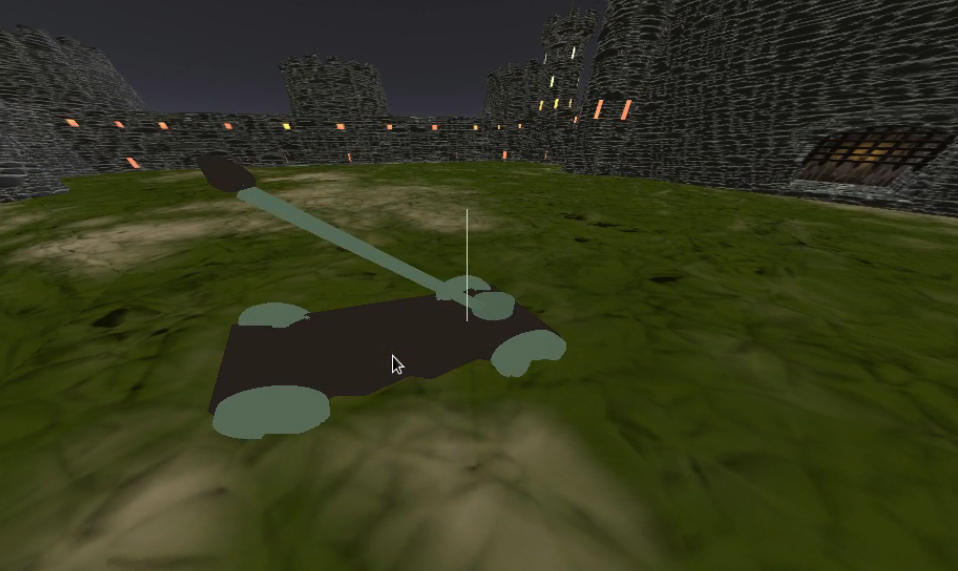
