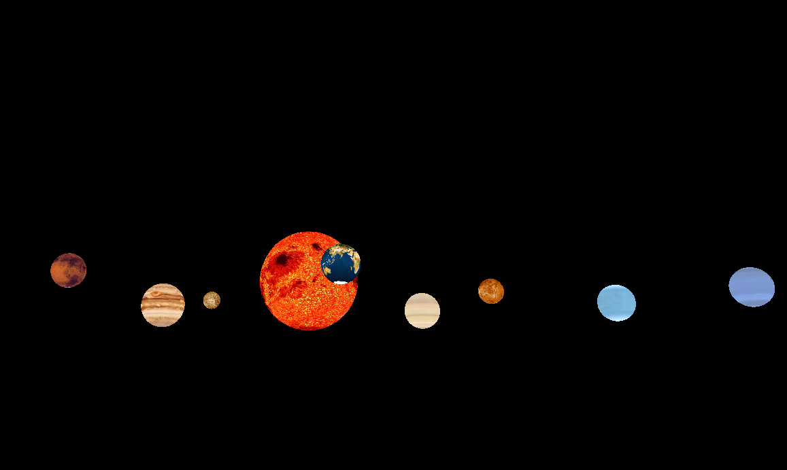
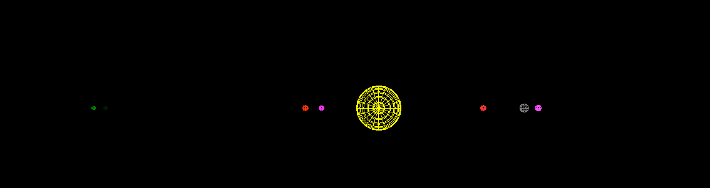
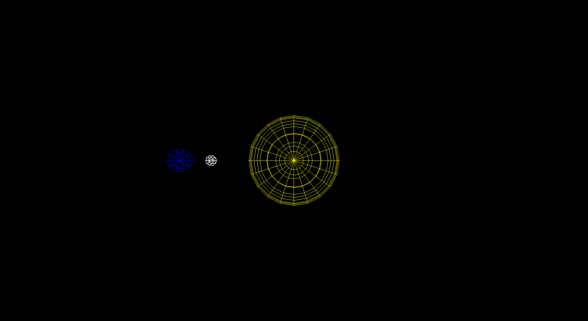
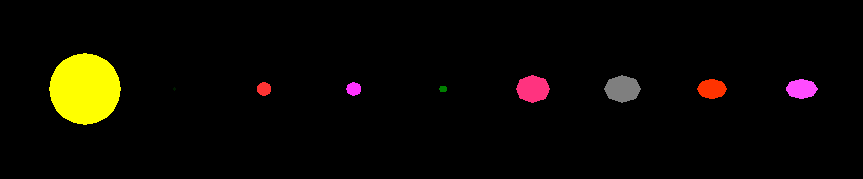

# Homework6: OpenGL Solar System

In this homework we'll build a solar system based on the concepts we learnt in the lab. Feel free to reuse your code.

### Task1: Setting up the planets:

Create a model of the solar system with 8 planets revolving around the Sun. Try to show some level of relative sizes (not upto scale).

Initialise a big window to fit everything conveniently.

### Task2: Not so lonely planet:

Add a moon that revolves around the Earth.

### Task3: Earth goes green:

Modify your code such that each sphere has a certain color and sun act as a source of light. You can achieve this by placing a light source at origin and using `glutSolidSphere` instead of `glutWireSphere`.

This is the sort of result you should get *before* incorporating lighting.

### Bonus Task:

Learn and implement textures in OpenGL. Find appropriate texture images and map them onto sun, earth and all other planets.

One possible source to learn could be: http://cse.csusb.edu/tongyu/courses/cs520/notes/texture.php

