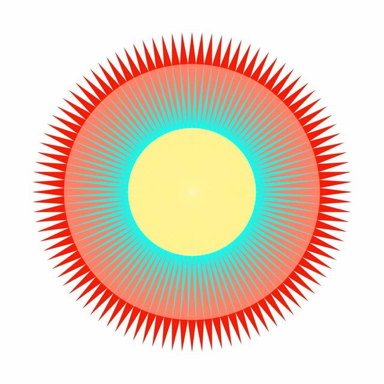
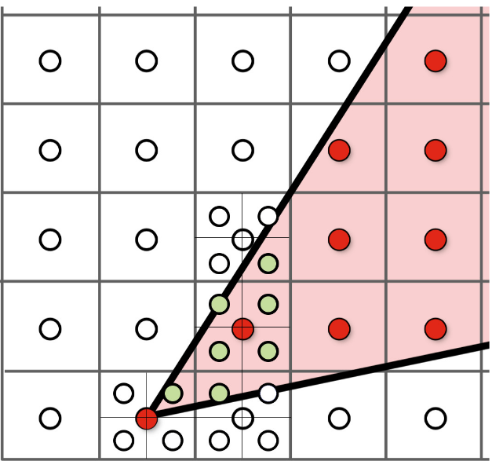
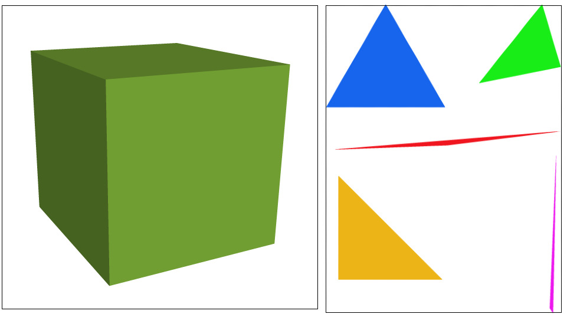

# Homework 1: Rasterizer Antialiasing
In this homework you will add antialiasing to your rasterizer. **Firstly, replace the *drawrend.cpp* file with your completed lab (all 5 parts).**

### Building the assignment

We will be using CMake to build the assignments. If you don't have CMake (version >= 2.8) on your personal computer, you can install it using apt-get on Linux or Macports/Homebrew (replace with brew and remove sudo) on OS X:

```!bash
sudo apt-get install cmake libx11-dev xorg-dev libglu1-mesa-dev freeglut3-dev libglew1.5 libglew1.5-dev libglu1-mesa libglu1-mesa-dev libgl1-mesa-glx libgl1-mesa-dev
```

To build the code, start in the folder that GitHub made or that was created when you unzipped the download. Run

    mkdir build
to create a build directory, followed by

    cd build
to enter the build directory. Then

    cmake ..
to have CMake generate the appropriate Makefiles for your system, then

    make
to make the executable, which will be deposited in the build directory.
    

**Don't forget to run
```make```
every time you make changes to your files.**

### What you will turn in

You will need to *zip* your **src** folder (located in your main directory) and submit it on LMS.

## Using the GUI

You can run the executable with the command

    ./draw ../svg/basic/test1.svg

After finishing Part 3, you will be able to change the viewpoint by dragging your mouse to pan around or scrolling to zoom in and out. Here are all the keyboard shortcuts available (some depend on you implementing various parts of the assignment):

|Key | Action|
|:-----:|------|
|`' '`  | return to original viewpoint|
|`'-'`  | decrease sample rate|
|`'='` | increase sample rate|
|`'Z'` | toggle the pixel inspector|
|`'P'` | switch between texture filtering methods on pixels|
|`'L'` | toggle scanLine|
|`'S'` | save a *png* screenshot in the current directory|
| `'1'-'9'`  | switch between svg files in the loaded directory|

The argument passed to `draw` can either be a single file or a directory containing multiple *svg* files, as in

    ./draw ../svg/basic/

If you load a directory with up to 9 files, you can switch between them using the number keys 1-9 on your keyboard.

### Homework structure

* Part 6: Retrieving sub-pixel colors
* Part 7: Filling in sub-pixels

There is a fair amount of code in the CGL library, which we will be using for future assignments. The relevant header files for this assignment are *   vector2D.h*, *matrix3x3.h*, *color.h*, and *renderer.h*.

Here is a very brief sketch of what happens when you launch `draw`: An `SVGParser` (in *svgparser.\**) reads in the input *svg* file(s), launches a OpenGL `Viewer` containing a `DrawRend` renderer, which enters an infinite loop and waits for input from the mouse and keyboard. DrawRend (*drawrend.\**) contains various callback functions hooked up to these events, but its main job happens inside the `DrawRend::redraw()` function. The high-level drawing work is done by the various `SVGElement` child classes (*svg.\**), which then pass their low-level point, line, and triangle rasterization data back to the three `DrawRend` rasterization functions.

## TASK III: Antialiasing triangles

Use supersampling to antialias your triangles. The `sample_rate` parameter in `DrawRend` (adjusted using the `-` and `=` keys) tells you how many samples to use per pixel.

The image below shows how sampling four times per pixel produces a better result than just sampling once, since some of the supersampled pixels are partially covered and will yield a smoother edge.



To do supersampling, each pixel is now divided into `sqrt(sample_rate) * sqrt(sample_rate)` sub-pixels. In other words, you still need to keep track of `height * width` pixels, but now each pixel has `sqrt(sample_rate) * sqrt(sample_rate)` sampled colors. You will need to do point-in-triangle tests at the center of each of these *sub-pixel* squares.

Each samplebuffer instance stores one pixel. Your task is to fill every sub-pixel with its correctly sampled color for every samplebuffer, and average all sub-pixels' colors within a samplebuffer to get a pixel's color. Instead of the `SampleBuffer::fill_pixel()` function, you will now use `SampleBuffer::fill_color()` function to write color to sub-pixels.

Your triangle edges should be noticeably smoother when using > 1 sample per pixel! You can examine the differences closely using the pixel inspector. Also note that, it may take several seconds to switch to a higher sampling rate.


### Part 6: Retrieving pixel color:

Go to the `DrawRend::get_pixel_color()` function in *drawrend.h* 

Using the color of each individual subpixel, compute and return the average color over the entire pixel. The subpixel color can be retrieved using the `get_subpixel_color()` function. 

### Part 7: Filling in sub pixels:

Go to the `DrawRend::rasterize_triangle()` function in *drawrend.cpp*.

Modify your loop from Part5 to perform point-in-triangle test on each individual **sub_pixel**. Use the `SampleBuffer::fill_color()` function to color each sub-pixel.

The function call should look something like: 
	`samplebuffer[row][column].fill_color(sr,sc,color)` - where (sr,sc) are the sub-pixel indices.

To test you implementation, run the following command:

	make;./draw ../svg/basic/

Adjust your samples per pixel by using the `-` and `=` keys.

If implemented correctly, you should see similar results:




If you're done early, try testing your implementation for the following files:

	make;./draw ../svg/illustration/

## 
<p align="center">
    
</p>

This assignment is adapted from UC Berkeley CS184 (https://cs184.eecs.berkeley.edu/article/3).

