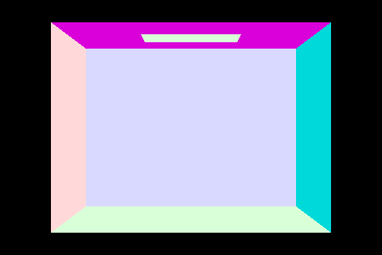
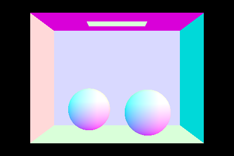
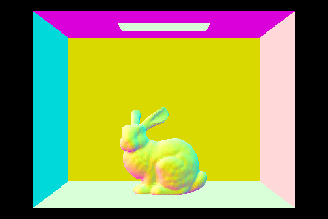
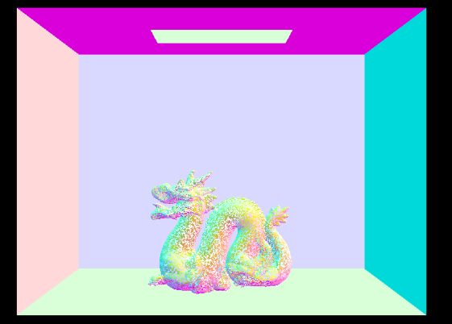

# Homework 3: Ray Tracing

## Logistics

### Deadline
* The deadline for the entire assignment is 11:55pm Monday, 12th Oct 2020.
* Late submission policies apply as stated on LMS.

### Building the assignment

In your assignment directory, execute this command:

```
mkdir build && cd build && cmake .. && make
```

## TASK II: Scene Intersection

### Part 6: Intersecting Triangles

Go to `Triangle::intersect()` method in `src/static_scene/triangle.cpp`. 

Use the [Moller Trumbore algorithm](https://www.scratchapixel.com/lessons/3d-basic-rendering/ray-tracing-rendering-a-triangle/moller-trumbore-ray-triangle-intersection) to perform ray-triangle intersection tests. 

Make sure you understand the derivation of the algorithm: here is one reference:

"Remember that not every intersection is valid -- the ray has min_t and max_t fields defining thevalid range of t values. If t lies outside this range, you should return false. Else, update max_t tobe equal to t so that future intersections with farther away primitives will be discarded."

You may find the following functions useful:

    dot(a,b)
    cross(g,h)

Once you get the ray's t-value at the intersection point, you should populate the `Intersection *isect` structure in the second version of the function as follows:

- t is the ray's -value at the hit point.n is the surface normal at the hit point. 

- Use barycentric coordinates to interpolate betweenn1, n2, n3, the per-vertex mesh normals.

- primitive points to the primitive that was hit (use the this pointer).

- bsdf points to the surface bsdf at the hit point (use get_bsdf())

Now run the following command and press **r** to render the scene.

    make && ./pathtracer -t 8 -r 480 320 ../dae/sky/CBempty.dae

You should be able to see the following scene:



Now that we are able to render both triangles (from this assignment) and spheres (from the lab), we can render more complex scenes.

Lets begin by running the simple:

    make && ./pathtracer -t 8 -r 480 320 ../dae/sky/CBspheres.dae

to get:




Now run the following commands to get the corresponding outputs:

(NOTE: They may take a long time to render; 120 seconds for CBbunny on a high-end machine)

    make && ./pathtracer -t 8 -r 480 320 ../dae/sky/CBbunny.dae



    make && ./pathtracer -t 8 -r 480 320 ../dae/sky/CBdragon.dae




Finally, run the following command:

    make && ./pathtracer -t 8 -r 480 320 ../dae/sky/CBlucy.dae
## Submission
Kindly execute the zipup.sh file provided in the main folder to generate the submission file. 

To generate the submission file run:

    chmod u+x zipup.sh && ./zipup.sh
