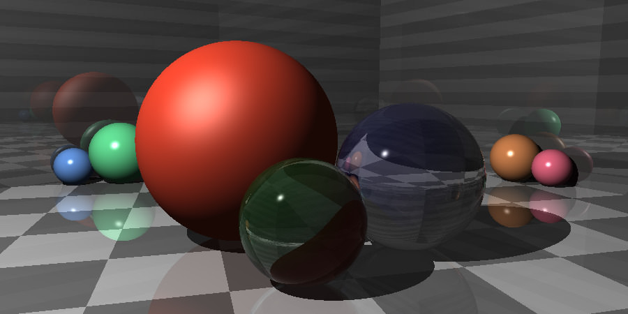
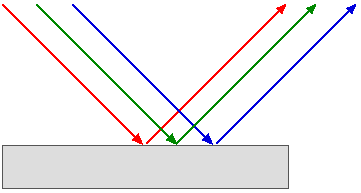
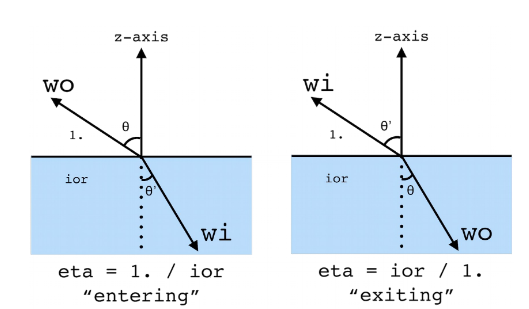
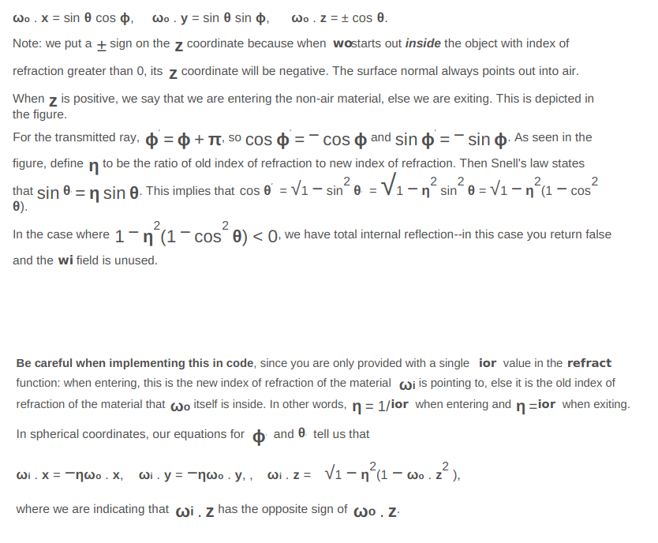
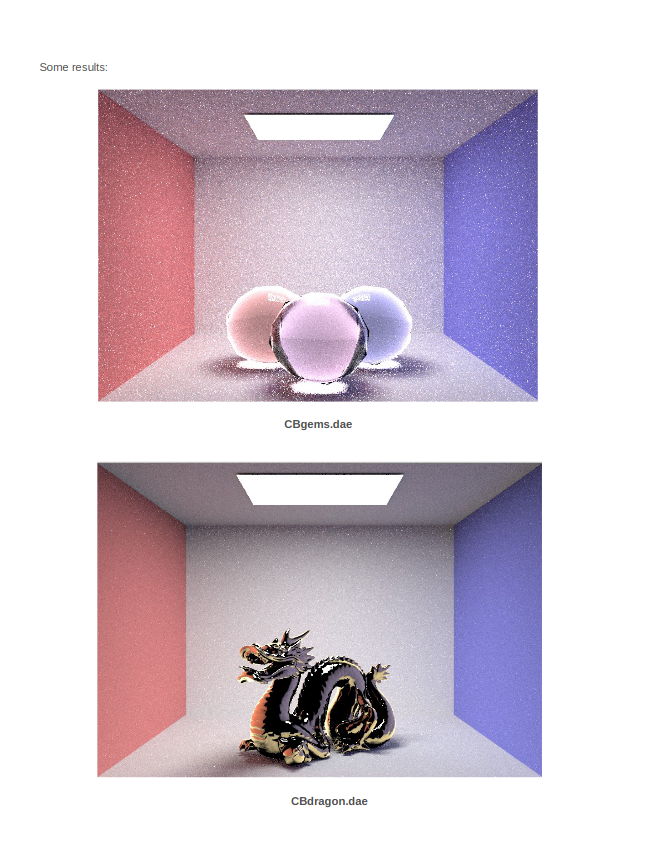

# Homework 5: Reflection & Refraction 

## Logistics

### Deadline
* The deadline for the entire homework is 11:55pm Monday, 26th Oct 2020.
* Late submission policies apply as stated on LMS.

### Building the assignment

In your assignment directory, execute this command:

```
mkdir build && cd build && cmake .. && make

```

## Project structure

- Task 1: Reflection
- Task 2: Refraction
- Bonus: Gloss

# Task1: Reflection



Go to the `BSDF::reflect()` function in *bsdf.cpp* and implement the reflection functionality.

We recommend taking advantage of the object coordinate space that BSDF calculations occur in. This means that the origin is the intersection point and the z axis lies along the normal vector. In this situation, reflection should be a trivial one-line transformation of the x,y,and z coordinates.


# Task2: Refraction



Go to the `BSDF::refract()` function in *bsdf.cpp* and implement the refraction functionality.

To see pretty glass objects in your scenes, you'll first need to implement the helper function `BSDF::refract()` that takes a `wo` direction and returns the `wi` direction that results from refraction. As in the reflection section, we can take advantage of the fact that our BSDF calculations always take place in a canonical "object coordinate frame" where the z axis points along the surface normal. This allows us to take advantage of the spherical coordinate Snell's equations. In other words, our `wo` vector starts out with coordinates: 




## Bonus Task (ungraded):
Implement `GlossyBSDF` in `bsdf.cpp`. You can test this by rendering `CBspheres_glossy.dae` and `Cbdragon_glossy.dae`.


