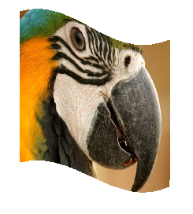

# Homework 2: Sampling Textures

In this homework, we'll be using barycentric coordinates for texture mapping.

## Logistics

### Building the codebase

Same CMake and OpenGL dependencies as in the previous labs/homework are required to run this codebase, so make sure you have those working.

Start in the folder that GitHub made or that was created when you unzipped the download. Run the following command once to create a build directory, enter it, have CMake generate the appropriate Makefiles for your systen and finally, make the executable, which will be deposited in the build directory.
```
mkdir build && cd build && cmake .. && make
```    

**Don't forget to run ```make``` every time you make changes to your files.**


### Submission
* Your lab and homework solutions are to be submitted on LMS by this upcoming Monday midnight 11:55 pm as usual. 
* You will need to *zip* your **src** folder and submit it on LMS with the naming convention specified there.
* Late submission is allowed with 10% deduction per day until the 6th day as specified on LMS for both components individually.


## Using the GUI

You can run the executable with the command

    make && ./draw ../svg/basic/test1.svg

After finishing Part 3, you will be able to change the viewpoint by dragging your mouse to pan around or scrolling to zoom in and out. Here are all the keyboard shortcuts available (some depend on you implementing various parts of the assignment):

|Key | Action|
|:-----:|------|
|`' '`  | return to original viewpoint|
|`'-'`  | decrease sample rate|
|`'='` | increase sample rate|
|`'Z'` | toggle the pixel inspector|
|`'P'` | switch between texture filtering methods on pixels|
|`'L'` | toggle scanLine|
|`'S'` | save a *png* screenshot in the current directory|
| `'1'-'9'`  | switch between svg files in the loaded directory|

The argument passed to `draw` can either be a single file or a directory containing multiple *svg* files, as in

    make && ./draw ../svg/basic/

If you load a directory with up to 9 files, you can switch between them using the number keys 1-9 on your keyboard.

### Structure

* Part 4: Computing uv coordinates
* Part 5: Implementing Bilinear sampling
* Part 6: Integrating SampleParams

There is a fair amount of code in the CGL library, which we will be using for future assignments. The relevant header files for this assignment are *vector2D.h*, *matrix3x3.h*, *color.h*, and *renderer.h*.

## Task II: "Pixel sampling" for texture mapping

Familiarize yourself with the `TexTri` and `SampleParams` struct in *svg.h*. *TexTri* is the primitive that implements texture mapping. For each vertex, you are given corresponding *uv* coordinates that index into the `Texture` pointed to by `*tex`. *SampleParams* is a struct containing all the sampling parameters - the psm which stands for the pixel sampling method (PixelSampleMethod enum) retrieved from the GUI having values for both nearest (P_NEAREST) and bilinear (P_LINEAR) sampling, as well as the sample pixel's UV vector and the level sampling method (lsm). You do not need to worry about the last since that has already been implemented.

### Part 4: Computing uv coordinates

Go to `TexTri::color` function in *svg.cpp*

Given the vertices of a triangle and the uv coordinates corresponding to each vertex, use barycentric coordinates to find and return the weighted combination of uv coordinates at point `(px,py)`.

`p0_uv`,`p1_uv`,`p2_uv` represent uv coordinates at vertices `p0`,`p1`,`p2`, respectively. Save the final uv coordinates in sp.uv and return sp, where sp is the SampleParams struct (you will find out how this struct is recieved here after implementing part 6).

For details on uv coordinates, you may want to refer back to [lecture 5](https://lms.lums.edu.pk/access/content/group/65ee2e09-48ea-47aa-bfe8-f8cfa8e06a08/Lectures/CS452_CG_L5_TextureMapping1.pdf).

To test your implementation, run the following command:

   	make;./draw ../svg/texmap/

If implemented correctly, you should be able to see the following images:


### Part 5: Implementing Bilinear Sampling

Go to `Texture::sample_bilinear` function in *texture.cpp*

Given the uv coordinates of a point, retrieve the color at this point using bilinear sampling. You may want to take a look at the `sample_nearest` function in texture.cpp before you begin. 

For details on Bilinear Sampling, you may want to refer back to [lecture 5](https://lms.lums.edu.pk/access/content/group/65ee2e09-48ea-47aa-bfe8-f8cfa8e06a08/Lectures/CS452_CG_L5_TextureMapping1.pdf).

Hint: Think about Floor() and Ceil() functions to generate 4 points.

### Part 6: Integrating Sample Params

Go to `DrawRend::rasterize_triangle` in *drawrend.cpp*. 

You should fill in the `psm` member (discussed in the task intro) of a new `SampleParams` struct and pass it to `tri->color(...)`. Look around the drawrend.cpp file and find out how this parameter is recieved by this codebase from the GUI.

Once done, execute following command in build directory. Cycle through different texmap files by pressing 1-6.

    make;./draw ../svg/texmap/

If implemented correctly, you should see slightly better images upon pressing 'P'.


