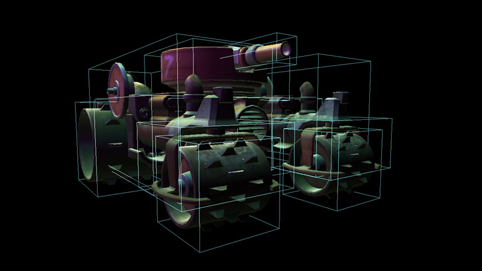
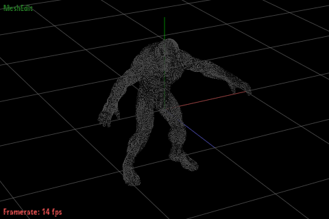
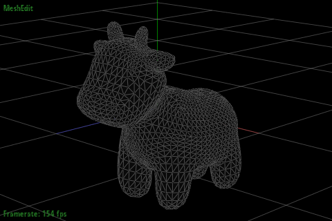
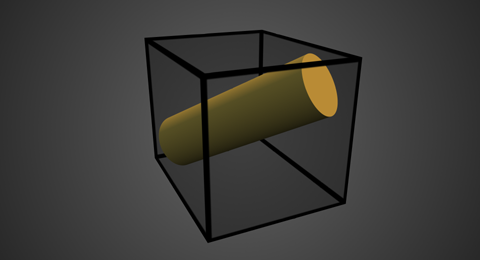
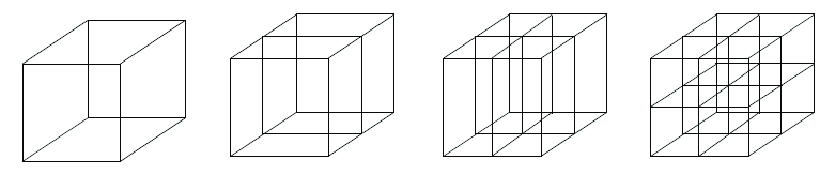
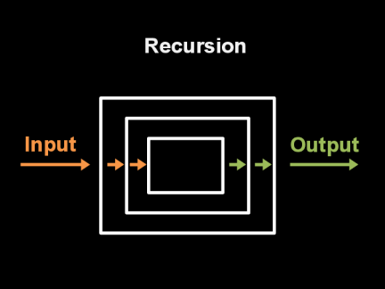
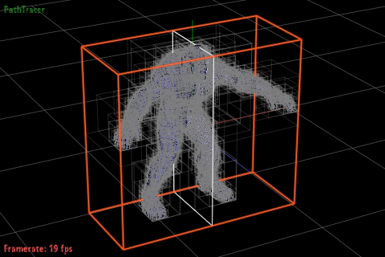
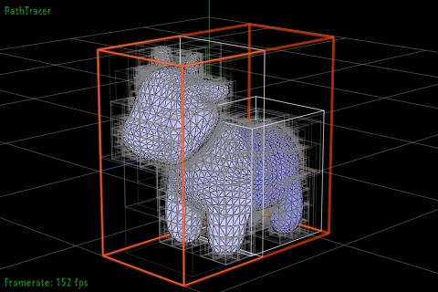

# Lab 4: Bounding Volume Hierarchy (Construction)

## Logistics

### Deadline
* The deadline for the entire lab is 11:55pm Monday, 19th Oct 2020.
* Late submission policies apply as stated on LMS.

### Building the assignment

In your assignment directory, execute this command:

```
mkdir build && cd build && cmake .. && make
```




## Project structure

- Part 1: Base Case
- Part 2: Axis of Recursion and Split point
- Part 3: Splitting
- Part 4: Recursive Calls

## TASK: Using recursion to construct the BVH

You may have noticed that any `.dae` files with even mildly complicated geometry take a very long time to render, even with only the simple normal shading. Even a BVH constructed with simple heuristics will perform much better (taking ray intersection complexity from linear to log).

Before beginning to code, note some important utility functions:
- `Primitive::get_bbox()` returns the bounding box of a `primitive`. 

- `BBox::expand()` expands a bounding box to include the function argument, which can either be a `Vector3D` or another `BBox`. 

- Check out the `Vector3D` members variables inside a `BBox`: `min`, `max`, `extent`, where `extent = max-min`

### Part 1: Base Case

Go to `BVHAccel:construct_bvh()` inside `bvh.cpp`

Take a look at the starter code to see how a BVH aggregate is built with a single leaf node (which is also the root) that encloses all the primitives.

1) If there are at most `max_leaf_size` primitives in the list `prims`, this is a leaf node. 

2) Allocate a **new** `Vector<Primitive \*>` for node's primitive list (initialize this with `prims`) and return the `node`.



### Part 2: Axis of Recursion and Split point

Go to `BVHAccel:construct_bvh()` inside `bvh.cpp`

If it's is not the base case, we need to recurse left and right. Take a look at the `BBox.extent` and `BBox.centroid()` before beginning this part. 

1) Find the largest dimension of the bounding box's `extent`, and save the index of the corresponding axis in an `int` variable. We will use it as our axis of recursion.

2) Calculate the midpoint of the bounding box and save it in a `Vector3D` variable. We will use it as a split point on our axis of recursion.

### Part 3: Splitting



Go to `BVHAccel:construct_bvh()` inside `bvh.cpp`

Split all primitives in `prims` into **two new vectors** based on whether their bounding box's centroid's coordinate in the chosen axis is less than or greater than the `split point`. 

A quick way to get a bounding box centroid for Primitive \*p:

    p->get_bbox().centroid()

### Part 4: Recursive Calls



Go to `BVHAccel:construct_bvh()` inside `bvh.cpp`

Recurse, assigning the *left and right children* of this node to be two new calls to `construct_bvh()`. Pass the two primitive lists you just generated into the recursive calls.

### Final Results:

To test your implementation, run the following command, and press **V** to enter BVHviz mode. 
You can then navigate around the BVH levels using the left, right, and up keys.

    make;./pathtracer -t 8 -r 480 320 ../dae/meshedit/beast.dae

You should see a similar output:





## 
##

This assignment is adapted from UC Berkeley CS184 (https://cs184.eecs.berkeley.edu/article/3).


