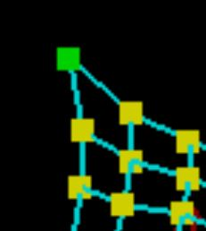

# Lab 10: CLOTH SIMULATION

In this lab, you will implement a real-time simulation of cloth using a mass and spring based system. You will build the data structures to discretely represent the cloth, define and apply physical constraints on them, and apply numerical integration to simulate the way cloth moves over time.

### Building the assignment

### Ensure you have python3-dev
  `sudo apt-get install python3-dev`
### Installing nanogui
Before moving forward, you need to have nanoGUI installed. 
In your assignment directory, execute this command:
    `mkdir ext; cd ext; git clone https://github.com/wjakob/nanogui --recursive; cd nanogui; mkdir build; cd build; cmake ..; make -j8`
### Builing the code base

Then go back to your assignment directory and exectue:
  `mkdir build; cd build; cmake ..; make`

After you have built the program using make, you will have an executable file clothsim that takes in zero or one argument. Running the program with zero arguments will load up the default scene (scene/pinned2.json). Otherwise, to load a specific scene, run the program as follows:

  `./clothsim -f ../scene/<my_scene>.json` 
 
 Running the following command without any code will produce an empty scene.
  `./clothsim`

## Section I: Masses and Springs

### Part 1: Checking for pinned masses 

Go to the `isPinned` function in `cloth.cpp`

Given the coordinates of a point, check if the point has been pinned or not, and return accordingly. Take a look at the pinned vector in `cloth.h` before you begin.

### Part 2: Finding the step size 

Go to the `buildGrid` function in `cloth.cpp`

Take a look at the 'cloth property variables' in `cloth.h` and use them to find your stepsize (the distance between neighbouring points on the grid) in the x and y directions.

### Part 3: Grid Construction

Go to the `buildGrid` function in `cloth.cpp`

Create an evenly spaced grid of masses. There should be `num_width_points` by `num_height_points` total masses spanning `width` and `height` lengths, respectively. 

If the cloth's orientation is `HORIZONTAL`, set the **y** coordinate for all point masses to 1 while varying positions over the **xz** plane. Otherwise (i.e. the orientation is `VERTICAL`), generate a small random offset between **-1/1000** and **1/1000** for each point mass and use that as the **z** coordinate while varying positions over the **xy** plane. You may find the `rand()` function useful. Let the top left (first) point mass be at coordinate (0, 0) and the bottom right (last) point mass be at coordinate (width, height) with respect to the varying plane. Store these point masses in the `point_masses` vector in row-major(X-axis) order (or else the rendering will not work properly).

The above mentioned implementation can be summarised in 5 steps:

Step 1) Check the `orientation`

Step 2) Create loops that run `num_height_points` by `num_width_points`

Step 3) In each iteration, compute the position of the new point using the stepsizes computed in part 2. 

Step 4) Create a pointmass using the `PointMass()` constructor, make sure you pass the information retrieved from the `isPinned()` function from part1.

Step 5) `push_back` the new pointmass into the `point_masses` vector

### Part 4: Finding Pointmass index 
 
Go to the `getIndex` function in `cloth.cpp`

Given the x and y coordinates of a point mass, compute and return it's index in the `point_masses` vector.

• Make sure to account for edge cases (literally).

• Pointer arithmetic can make things a lot easier here.

• Since `point_masses` is a 1-dimensional vector, review how to convert a point mass's 2-D grid index into a 1-D vector index

### Part 5: Springs and Constraints

Go back to the `buildGrid` function in `cloth.cpp`

Create springs to apply the *structual, shear,* and *bending* constraints between point masses. Each of these springs can be created using the `Spring()` constructor that takes in pointers to the two point masses that belong at the two ends of the spring and an enum that represents the type of constraint (STRUCTURAL, SHEARING, or BENDING).

    1.Structural constraints exist between a point mass and the point mass to its left as well as the point mass above it.

    2.Shearing constraints exist between a point mass and the point mass to its diagonal upper left as well as the point mass to its diagonal upper right.

    3.Bending constraints exist between a point mass and the point mass two away to its right as well as the point mass two above it

### Test your implementation

Once you've completed section I, run the following command in the build directory:

    make; ./clothsim -f ../scene/pinned4.json

You should see a horizontally flat cloth wireframe similar to the image below (after moving the camera around a bit).To make sure your springs are correctly created, try enabling and disabling the three different constraints on the GUI. You should see some springs appear and disappear accordingly; make sure they are the ones you expected to appear and disappear!

## Section II: Simulation via numerical integration

Now that we have set up the cloth model as a system of masses and springs, we need to integrate the physical equations of motion inorder to apply the forces on our cloth's point masses to figure out how they move from one time step to the next.Take a look at `Cloth::simulatein cloth.cpp`. This method runs one time step in the simulation of time length `delta_t`(dt in equations below) and applies the `accelerations` uniformly to all point masses in the cloth. The `ClothParameters *cp argument` contains the parameters that characterize the cloth and its simulation, such as the spring constant ksand which spring constraints to simulate. `collision_objects` contains all of the objects in the scene that the cloth needs to check for collisions with at each time step.

In our representation, there are two kinds of forces: external forces(such as gravity) which uniformly affect the cloth and spring correction forces which apply the spring constraints from before to keep the cloth together. The external forces are captured by `external_accelerations`. On the other hand, the spring correction forces vary between point masses and will be computed based on the state of each spring. 

Note: Every point mass has a vector representing the total force vector acting upon it called forces. Use this vector to accumulate the forces acting on each point mass as you compute them. Be sure to clear/reset them at the start of each call to simulate so as to not accumulate extra, nonexistant forces.

Now that we have computed the force acting on each point mass for this time step, we need to perform numerical integration to compute each point mass's change in position. There are many ways of integrating our equations, which include Euler's method (explicit and implicit), Verlet algorithm, Runge-Kutta method, and more. Here, we will use Verlet integration, an explicit integrator that is fairly accurate and relatively easy to implement.

Verlet integration computes a point mass's new position at time t + dt, x_{t + dt} as follows:

`x_{t + dt} = x_t + v_t * dt + a_t * dt^2` where `x_t` is the current position, `v_t` is the current velocity, `a_t` is the current total acceleration from all forces, and `dt` is a timestep `delta_t`.

In Verlet integration, we approximate `v_t * dt = x_t -x_{t -dt}`, where `x_{t -dt}` is the position from the last time step.

`x_{t + dt} = x_t + (x_t -x_{t -dt}) + a_t * dt^2` 

This can be simplified to the following expression:

`x_{t + dt} = 2x_t -x_{t -dt} + a_t * dt^2` 

However, we can add some damping into the simulation to help simulate loss of energy due to friction, heat loss, etc. by slightly scaling down v_t:

`x_{t + dt} = x_t + (1 - d) * (x_t -x_{t -dt}) + a_t * dt^2` 

### Part 7: External Forces 

Go to the `simulate()` function in `cloth.cpp`

Given the vector `external_accelerations` that contains the external acceleration on each individual point mass, calculate the total external acceleration by adding all of them together. Now calculate the **total external force**  using Newton's 2nd law: `F = ma`, where the total external acceleration can be used as `a` while the mass of 1 pointmass can be used as `m`. 

Apply this external force to every point mass.

### Part 8: Spring Correction Forces 

Go back to the `simulate()` function in `cloth.cpp`

Apply the spring correction forces. For each spring, skip over the spring if that spring's constraint type is currently disabled. You can check this using `cp`, which has boolean values such as `enable_structural_constraints`. Otherwise, compute the force applied to the two masses on its ends using Hooke's law:

    F_s = k_s * (|| p_a - p_b|| - l)
    
    where k_s is the spring constant (ks), p_a and p_b are the positions of the two masses, || indicates magnitude, and l is the spring's rest length (rest_length).

The force vector is the vector pointing from one point mass to the other with magnitude equal to `||F_s||`. Apply this force to one point mass and an equal, but opposite force to the other.

### Part 9: Compute new point mass positions

Go back to the `simulate()` function in `cloth.cpp`

    x_{t + dt} = x_t + (1 - d) * (x_t -x_{t -dt}) + a_t * dt^2
  
    where `d` is a damping term (usually very small) between 0 and 1. 

Let `d` be the given damping value in `cp` (note that the damping value is given in units of percentage, so divide by 100 before subtracting from 1), for each point mass, update the value in pointmass's `position` according to the above equations and store the previous time step's position in the pointmass's `last_position`. 

Do not do anything if the point mass is pinned!

### Part 10: Constrain position updates

To help keep springs from being unreasonably deformed during each time step, we will implement an additional feature based on the *SIGGRAPH 1995 Provot paper on deformation constraints in mass-spring models*. For each spring, apply this constraint by correcting the two point masses' positions such that the spring's length is at most 10% greater than its `rest_length` at the end of any time step. Maintain the same vector direction between the two point masses and only modify their distance apart from each other. 

Perform half of the correction to each point mass, unless one of them is pinned, in which case apply the correction entirely to one point mass. Do nothing if both are pinned (they wouldn't satisfy the condition anyways, by construction).

### Test your implementation

Once you've completed section II, run the following commands in the build directory:

    make
    ./clothsim -f ../scene/pinned2.json

You should see your cloth (with 2 corners pinned) fall down fairly realistically to a rest state!

