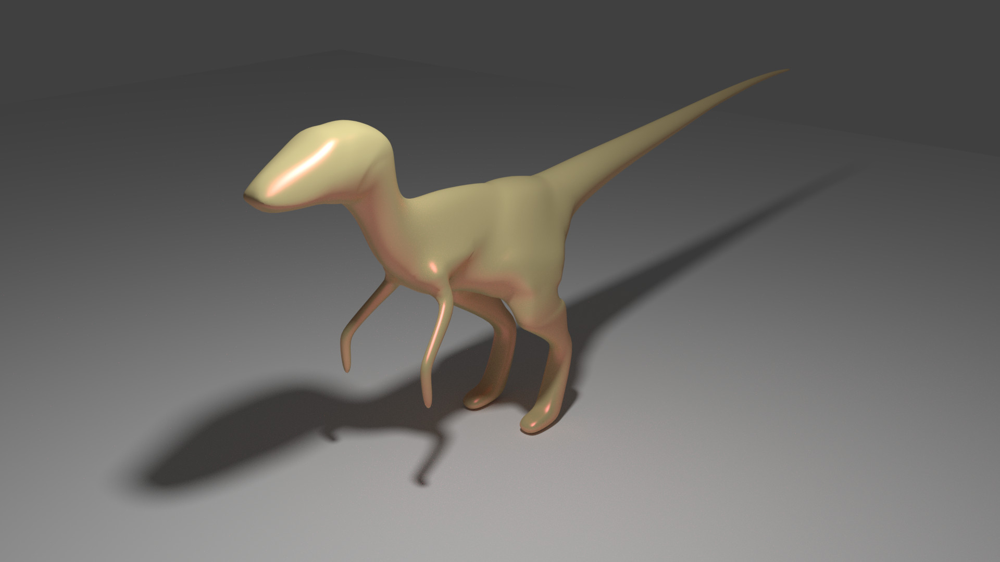
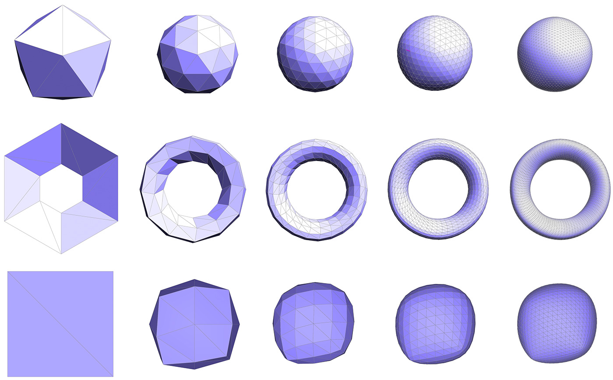
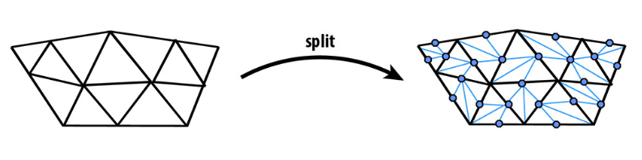
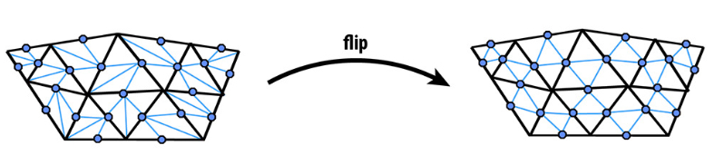
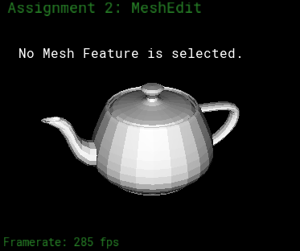

# Lab 9: Loop Subdivision for Mesh Upsampling

In the last lab, we dealt with Bezier curves and surfaces, parametric functions that were defined by a set of control points. Through de Casteljau's algorithm, we performed subdivision that allowed us to evaluate those functions. With Bezier curves, we performed 1D subdivision, and evaluation steps were relatively simple since adjacent controlpoints were trivially retrieved from a 1D vector. With Bezier surfaces, we applied the same 1D subdivision concepts inboth dimensions, and evaluation steps were a little more complicated, but adjacent control points were still easily retrieved from the 2D grid of control points.

What about generic triangle meshes? Here, the only rules are that our mesh is made up of triangles and that the triangles connect to each other through their edges and vertices. There is no constraining 2D grid as before with Beziersurfaces. As a result, adjacency is unfortunately no longer trivial. Enter the half-edge data structure, a powerful and popular data structure commonly used to store mesh entities and their connectivity information.

Note: Before diving into the lab tasks, be sure to first take a look at your lecture slides to help you navigate the HalfedgeMesh class, which you will use extensively this weekend.

Loop subdivision is somewhat analogous to upsampling using some interpolation method in image processing: we mayhave a low-resolution polygon mesh that we wish to upsample for display, simulation, etc. Simply splitting each polygoninto smaller pieces doesn't help, because it does nothing to alleviate blocky silhouettes or chunky features. Instead, weneed an upsampling scheme that nicely interpolates or approximates the original data. Polygon meshes are quite a bit trickier than images, however, since our sample points are generally at irregular locations, i.e., they are no longer found at regular intervals on a grid.

## Part 1: Vertex Subdivision

The following picture depicts the correct weighting for the new averaged vertex positions:

Written out, the new position of an old vertex is:

    (1 - n*u) * original_position + u * neighbor_position_sum

    where n is the number of neighboring vertices, u is a constant as depicted in the figure above, original_positionis the vertex's original position, and         neighbor_position_sum is the sum of all neighboring vertices' positions.

Go to `MeshResampler::upsample` function in `student_code.cpp`.

Step1: Loop over all the vertices in the mesh. You can do this by creating a `VertexIter` v that starts from `mesh.verticesBegin()` and ends at `mesh.verticesEnd()`. Code all the steps velow within this loop. *(This step has already been implemented for you)*

Step2: Mark all vertices as belonging to the original mesh by setting `Vertex::isNew` to false for all vertices in the mesh.

Step3: Check for the number of neighbouring vertices of each vertex v (The degree of v). If there are 3 neibouring vertices, set the value of the contant `u` to 3/16, otherwise: set it to 3/(8n).

Step4: Now create another loop and sum over all the neighbouring vertex positions. This can be done by creating a `HalfedgeCIter`**hI** that begins at `v->halfedge();` and ends at `v->halfedge()`. The neighbouring vertex position can be calculated as `hI->twin()->vertex()->position`. You can move from one vertex to another using `hI->twin()->next()`.

Step5: Finally, compute updated positions for all vertices in the original mesh using the vertex subdivision rule above, and store them in `Vertex::newPosition`.

## Part 2: Edges

The position for a newly created vertex v that splits an edge AB connecting vertices A and B and is flanked by opposite vertices C and D across the two faces connected to AB in the original mesh will be:

    3/8 * (A + B) + 1/8 * (C + D)

Go back to `MeshResampler::upsample` function in `student_code.cpp`.

Step1: Loop over all the edges in the mesh. You can do this by creating an `EdgeIter` e that starts from `mesh.edgesBegin()` and ends at `mesh.edgesEnd()`. Code all the steps below within this loop. *(This step has already been implemented for you)*

Step2: Mark all edges as belonging to the original mesh by setting `Vertex::isNew` to false for all vertices in the mesh.

Step3: Evaluate A, B, C and D for each edge as follows:

    A = e->halfedge()->vertex()->position;
  
    B = e->halfedge()->twin()->vertex()->position;
    
    C = e->halfedge()->twin()->next()->twin()->vertex()->position;
    
    D = e->halfedge()->next()->twin()->vertex()->position;
 
Step4: Now use the above mentioned scheme to compute the new position of the vertices to be inserted at edge mid-points and store them in `Edge::newPosition`.

Step: Finally, push all the edges in the `vector<EdgeIter> original_edges` vector.

## Part 3: Edge Splitting

Go back to `MeshResampler::upsample` function in `student_code.cpp`. 

Step 1: Loop over all the `original_edges`. *(This step has already been implemented for you)*

Step 2: Split every edge in the mesh using `mesh.splitEdge(e)`. It will return an iterator to the newly inserted vertex **W**.

Step 3: Mark all vertices as belonging to the new mesh by setting `Vertex::isNew` to true for all vertices in the mesh.

Step 4: Copy the `newPosition` field from the edge being split into the `newPosition` field of the newly inserted vertex W.

Step 5: Extract the `HalfedgeIter` of each of these vertices by using `VertexIter->halfedge()`. 

Step 6: Flag each outgoing edge as either being new or part of the original mesh. You may use the following scheme:

    HalfedgeIter->twin()->next()->edge()->isNew = true;
    HalfedgeIter->next()->next()->edge()->isNew = true; 

    HalfedgeIter->edge()->isNew = false; // the halfedge of this vertex will point along the edge of the original mesh so its isNew should be false

You can also test edge splitting by selecting an edge and pressing the **S** key in the Mesh Editor.  

## Part 4: Edge Flipping

Go back to `MeshResampler::upsample` function in `student_code.cpp`.

Step1: Loop over all the edges in the mesh. You can do this by creating an `EdgeIter` e that starts from `mesh.edgesBegin()` and ends at `mesh.edgesEnd()`. Code all the steps below within this loop. *(This step has already been implemented for you)*

Step2: Check if an edge e is new. If it is: check if the *vertex of its halfedge* and *vertex of its twin's halfedge* are new. If both of them are new or both of them are old: flip the edge using `mesh.flipEdge(e)`.

You can also test edge flipping by selecting an edge and pressing the **F** key in the Mesh Editor.  

## Part 5: Vertex Update

Go back to `MeshResampler::upsample` function in `student_code.cpp`.

Now loop over all the vertices from the original mesh and for each vertex v, update the value of `v->position` with `v->newPosition`. 

To test your implementation, run the following command and press:

    make; ./meshedit ../dae/teapot.dae

Now upon pressing **U**, you should clearly see the following progression in outputs:

