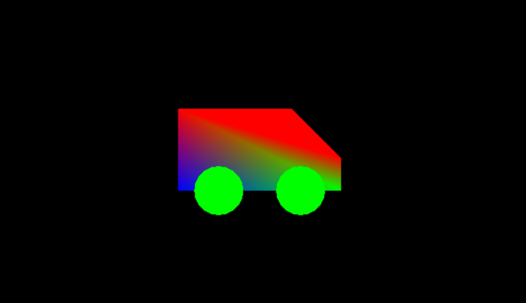
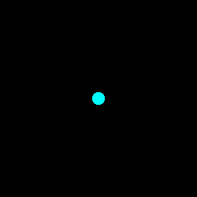
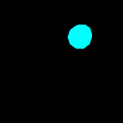
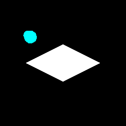
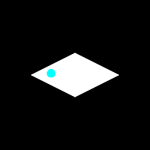
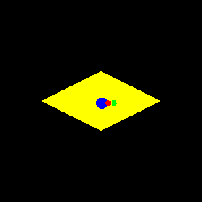

# Lab 7: OpenGL Keyboard and Movement

Command to run your file: `g++ platform.cpp -lglut -lGLU -lGL; ./a.out`

### Part1: Drawing the object.

Go to the `display()` function in `platform.cpp`.

Use your understanding of OpenGL from the previous lab to draw a solid sphere on the screen.

### Part2: Keyboard

Go to the `keyboard()` function in `platform.cpp`.

The `x`, `y` and `z` variables denote the coordinates of the object. Use them to connect the 'w','a','s','d' keys to movement in the x and y axis. Use the 'q' and 'e' keys to connect the z-axis.

### Part3: Movement

Go to the `display()` function in `platform.cpp`.

Now use the `x`, `y` and `z` variables to translate the object to the final position. The command for translation is given below:

    glTranslatef(x, y, z);

### Part4: Platform

Go to the `display()` function in `platform.cpp`.

Now create a ground for the object to rest upon. You may do this by creating a `GL_QUAD`. The `l1` and `w1` variables given at the top are the length and width of the quad while the `h1` variable is the height at which this plane lies.

The command for adding a vertex is given below:

glVertex3f(x, y, z);

### Part5: Bounded Movement:

There are several schemes that you may use to bound your movement to the ground plane. You will now implement one such scheme that does not only restrict the object to the surface of the plane, but also does not let the player exceed the bounds of the quad:

Let's say one of the vertices of the quad has coordinates: `X0`, `Y0`, `Z0`, while the dynamic object has coordinates `x`, `y`, `z`.

A certain instruction(lets say pressing key 'w') is desired to move the object towards this vertex 0. Upon this command, the coordinates of the object are re-calculated as follows:

      x = x + gamma * (X0-x)
      
      where gamma is a small step of movement

To achieve the bounded movement, repeat the above mentioned command for each vertex.

### Part6: Complex Structures:

Complex structures can be easily made by adding a small transformation between each component.

Try to attach 2 more spheres to the first one to make an object that looks something like this:

