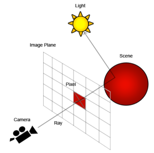
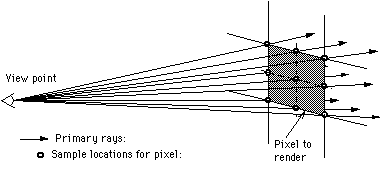
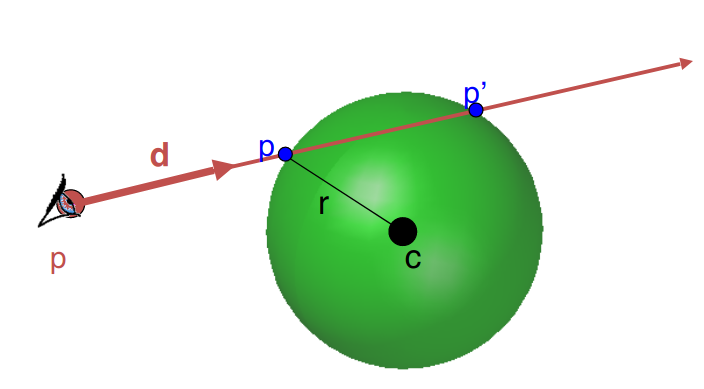
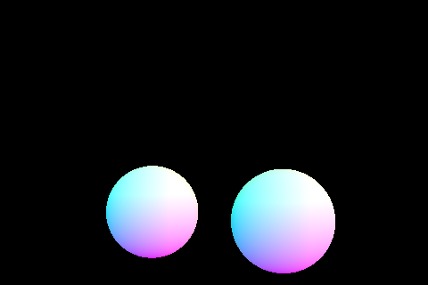

# Lab 3: Ray Tracing

## Logistics

### Deadline
* The deadline for the entire lab is 11:55pm Monday, 12th Oct 2020.
* Late submission policies apply as stated on LMS.

### Building the assignment

In your assignment directory, execute this command:

```
mkdir build && cd build && cmake .. && make
```

## Project structure

- Part 1: Tracing a single ray
- Part 2: Tracing multiple rays
- Part 3: Generating Camera rays
- Part 4: Ray-sphere intersection
- Part 5: Integrating the test

## TASK I: Filling in the sample loop

Before beginning to code, take a look at the `Pathtracer` class in `pathtracer.h/.cpp` and the `Ray` class is `ray.h`. You will need to refer back to the variables and methods in these classes.

### Part 1: Tracing a single ray

Go to `PathTracer::raytrace_pixel()` in `pathtracer.cpp`. 

1) Given the coordinates of the bottom-left corner of a pixel `(size_t x, size_t y)`, you must generate a ray through the center of this pixel using `camera->generate_ray(cx,cy)` where cx, cy are between [0,1]. You will need to scale your cx and cy using `sampleBuffer.w` and `sampleBuffer.h` before generating the ray.

2) Set the `depth` of this `ray` to max ray depth. 

3) Trace the ray using `trace_ray(ray,true)` and return the output `Spectrum`. This is amount of energy arriving on the pixel or the brightness/irradiance (in RGB) retrieved from the traced ray.

Remember to be careful about mixing int and double data types here, since the input variables are integers.



### Part 2: Tracing multiple rays

Go to `PathTracer::raytrace_pixel()` in `pathtracer.cpp`.

Modify your function to trace `ns_aa` number of rays through the pixel (ns_aa is the abbreviation for *number of samples along one axis*).

1. If the number of rays is 1, use your implementation from the first part to trace this single ray. Otherwise, create a loop that runs `ns_aa` times.

1. In each iteration of the loop, generate a random sample between **[0,1]^2** using `gridSampler->get_sample()`. Use this random sample to generate a ray through the given pixel (remember scaling). Set ray depth to max and trace this ray to retrieve an output spectrum. 

1. Average over all the output spectrums retrieved and return the final Spectrum. This final Spectrum essentially corresponds to an estimate of the integral of irradiance over this pixel. 

*Note: The following image shows multiple points sampled over 1 pixel using multiple rays. The bottom left point is (0,0). Also, these samples in the image appear equidistant, however, we are taking samples at random positions throughout the pixel.*



### Part 3:  Generating Camera rays

The camera has its own coordinate system. In camera space, the camera is positioned at the origin, looks along the `-z` axis, has the `+y` axis as image space "up". Given the two field of view angles `hFov` and `vFov`, we can define a sensor plane one unit along the view direction with its bottom left and top right corners (in terms of x,y,z stored as Vector3D) at       
    `Vector3D(-tan(radians(hFov)*.5),-tan(radians(vFov)*.5),-1)` and 
    `Vector3D( tan(radians(hFov)*.5),  tan(radians(vFov)*.5),-1)` respectively. 


Go to `Camera::generate_ray()` in `camera.cpp`.

Given the coordinates of a point x,y (that you passed into it in Part 1), generate the corresponding **world space ray**. First, closely look at how a `Ray` is represented in `ray.h`. Then, follow these steps, one by one:

1. Convert the input point (x, y) to a point on this sensor such that `(0,0)` maps to the bottom left and `(1,1)` maps to the top right *(so x and y are interpolated between this [0,1]^2 range)*. This is your ray's direction vector in camera space. 

1. Convert this vector to world space by applying the transform `c2w`. (You can apply certain transformations to vectors by just multiplying relevant matrices, in this case the 3x3 Matrix c2w.) This converted vector becomes our `r.d` for our ray. Remember to normalize it using the `normalize()` method, since it is a direction vector. 

1. Now construct a `Ray` using the camera's position/origin stored as `pos` and depth **0**. The ray's minimum and maximum `t` values should be the `nClip` and `fClip` camera parameters respectively. 

## TASK 2: Scene Intersection

### Part 4: Ray-Sphere Intersection

Go to the first `Sphere::test()` in `static_scene/sphere.cpp`.

Given a Ray `r`, use the **ray-sphere intersection test** learned in class to find whether this ray intersects with the given sphere or not. You can access the origin and the radius of this sphere using the `object->o` and `object->r` variables. 

You may find the follwing functions useful:
    
    dot(a,b)
    
    sqrt(c)
    
    swap(e,f)
    

In case of an intersection, save the value of the smaller **t** in `t1` and the larger **t** in `t2`; and return true. Otherwise, return false.



### Part 5: Integrating the test

Go to `Sphere::intersect()` in `static_scene/sphere.cpp`.

Given a Ray `r`, use the function that you just created to test if the ray intersects with the sphere. If it does, use the computed values of **t** to find the point of intersection as well its normal (Refer back to the slides).

Now check if the value of **t** lies within the required range (between `max_t` and `min_t`) and if it does, populate the provided intersection instance `i` with the appropriate parameters. 

- Set `i->primitive` to `this`.
- Call the `get_bsdf()` function to get the value for `i->bsdf`.
- Set the `r.max_t`,`i->t`, `i->n` parameters yourself.
- Return `true`/`false` depending on the situation.

Now run the following command and press **r** to render the scene.

    make;./pathtracer -t 8 -r 480 320 ../dae/sky/CBspheres.dae

You should be able to see the following spheres.




